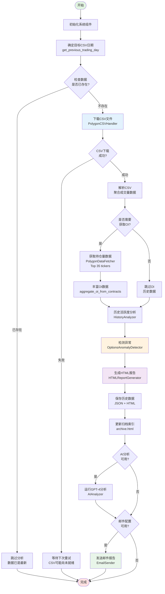
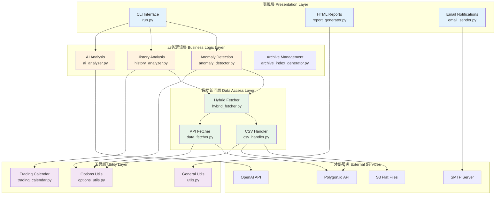
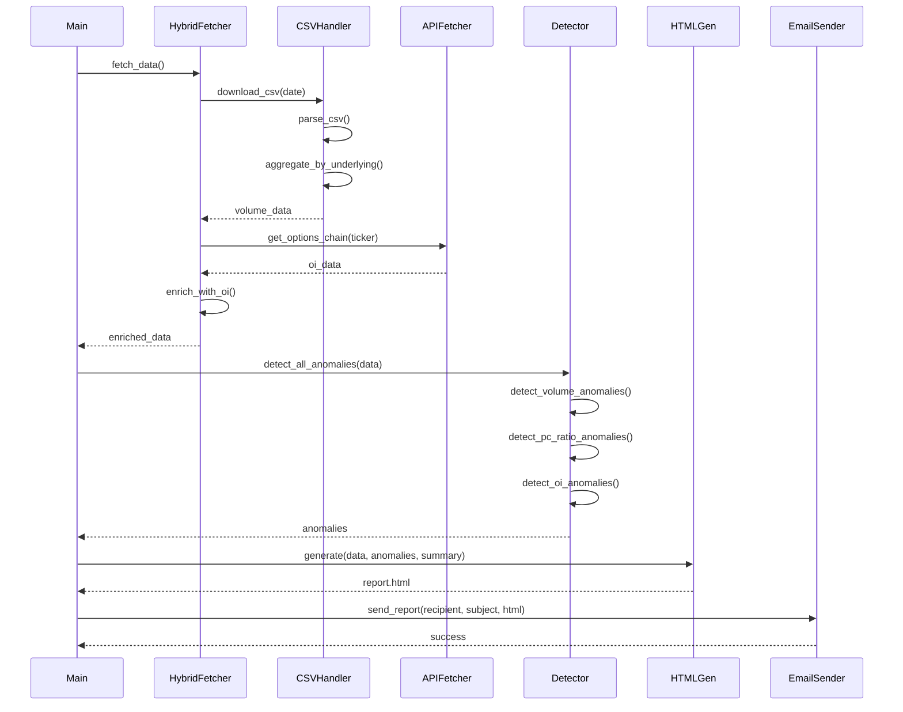
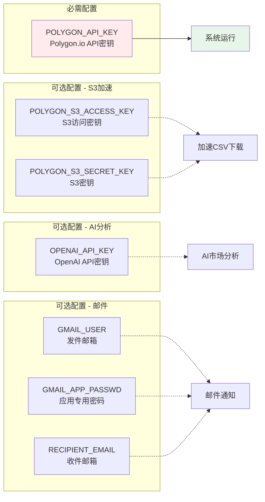
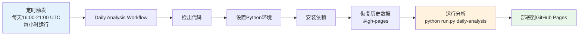

# 📊 Options Anomaly Detector - 代码结构文档

## 🎯 系统概述

Options Anomaly Detector 是一个期权市场异常检测和分析系统，采用混合数据获取策略（CSV + API），能够高效地分析期权市场数据并生成可视化报告。

---

## 🔄 主流程图



---

## 📦 类图

```mermaid
classDiagram
    %% 主入口
    class Main {
        +main()
    }

    %% 数据获取层
    class HybridDataFetcher {
        -api_key: str
        -csv_handler: PolygonCSVHandler
        -api_fetcher: PolygonDataFetcher
        +fetch_data(strategy, top_n_for_oi)
        +enrich_with_oi(data, top_n, trading_date)
        +get_strategy_info()
    }

    class PolygonCSVHandler {
        -api_key: str
        -s3_client: boto3.client
        -base_url: str
        +download_csv(date, save_to_disk)
        +parse_csv(csv_data)
        +aggregate_by_underlying(df, trading_date)
        +try_download_and_parse(date, max_retries)
        -_calculate_leap_cp_from_contracts(contracts_df, trading_date)
        -_get_top_contracts_by_volume(contracts_df, trading_date, total_volume)
    }

    class PolygonDataFetcher {
        -api_key: str
        -base_url: str
        -session: requests.Session
        +get_options_chain(ticker)
        +aggregate_options_by_underlying(tickers)
        +get_top_active_tickers(limit)
    }

    %% 分析层
    class OptionsAnomalyDetector {
        -anomalies: list
        +detect_all_anomalies(data)
        +detect_volume_anomalies(data)
        +detect_pc_ratio_anomalies(data)
        +detect_oi_anomalies(data)
        +get_summary()
        +get_top_anomalies(limit)
    }

    class HistoryAnalyzer {
        -output_dir: str
        -lookback_days: int
        +get_trading_days(end_date, count)
        +load_historical_data(dates)
        +analyze_ticker_history(ticker, history)
        +enrich_data_with_history(current_data)
    }

    class AIAnalyzer {
        -api_key: str
        -model: str
        +is_available()
        +analyze_market_data(data, anomalies, summary)
        +generate_email_subject(data, anomaly_count, trading_date)
        +format_for_email(analysis, data, summary, trading_date)
    }

    %% 输出层
    class HTMLReportGenerator {
        +generate(data, anomalies, summary, metadata, output_file)
        -_generate_html_content(data, anomalies, summary, metadata)
        -_generate_charts_js(data, anomalies)
    }

    class EmailSender {
        -gmail_user: str
        -gmail_app_passwd: str
        -smtp_server: str
        -smtp_port: int
        +is_available()
        +send_report(recipient, subject, html_content)
    }

    class ArchiveIndexGenerator {
        +get_archived_reports(output_dir)
        +generate_archive_index(reports, output_file)
    }

    %% 工具类
    class OptionsUtils {
        +parse_option_ticker(ticker)
        +parse_expiry_date(expiry_str, format_type)
        +analyze_strike_concentration(strike_dict, total_oi)
        +aggregate_oi_from_contracts(contracts, trading_date)
        +calculate_leap_cp_ratio(contracts, trading_date)
    }

    class TradingCalendar {
        -holidays: list
        +is_trading_day(date)
        +get_previous_trading_day(from_date)
        +has_trading_days_between(start_date, end_date)
        +get_trading_calendar()
    }

    class Utils {
        +print_banner()
        +print_summary_table(data)
        +print_anomalies_summary(anomalies, summary)
        +get_market_times()
        +get_market_session(et_time)
        +format_market_time_html(time_info)
    }

    %% 关系
    Main --> HybridDataFetcher : 使用
    Main --> OptionsAnomalyDetector : 使用
    Main --> HistoryAnalyzer : 使用
    Main --> HTMLReportGenerator : 使用
    Main --> AIAnalyzer : 使用
    Main --> EmailSender : 使用
    Main --> ArchiveIndexGenerator : 使用
    Main --> TradingCalendar : 使用
    Main --> Utils : 使用

    HybridDataFetcher --> PolygonCSVHandler : 组合
    HybridDataFetcher --> PolygonDataFetcher : 组合
    HybridDataFetcher --> OptionsUtils : 使用

    PolygonCSVHandler --> OptionsUtils : 使用
    PolygonCSVHandler --> Utils : 使用

    PolygonDataFetcher --> OptionsUtils : 使用

    HistoryAnalyzer --> TradingCalendar : 使用

    HTMLReportGenerator --> Utils : 使用
```



---

## 🏗️ 架构分层



---

## 📂 核心模块说明

### 1️⃣ **数据获取模块** (Data Access Layer)

| 模块 | 文件 | 职责 | 关键方法 |
|------|------|------|----------|
| **混合数据获取器** | `hybrid_fetcher.py` | 协调CSV和API数据获取 | `fetch_data()`, `enrich_with_oi()` |
| **CSV处理器** | `csv_handler.py` | 下载和解析Polygon CSV文件 | `download_csv()`, `parse_csv()`, `aggregate_by_underlying()` |
| **API数据获取器** | `data_fetcher.py` | 从Polygon API获取实时数据 | `get_options_chain()`, `aggregate_options_by_underlying()` |

### 2️⃣ **分析模块** (Business Logic Layer)

| 模块 | 文件 | 职责 | 关键方法 |
|------|------|------|----------|
| **异常检测器** | `anomaly_detector.py` | 检测交易量、C/P比率、持仓量异常 | `detect_all_anomalies()`, `detect_volume_anomalies()` |
| **历史分析器** | `history_analyzer.py` | 分析标的历史活跃度 | `enrich_data_with_history()`, `analyze_ticker_history()` |
| **AI分析器** | `ai_analyzer.py` | 使用GPT-4进行市场分析 | `analyze_market_data()`, `generate_email_subject()` |

### 3️⃣ **输出模块** (Presentation Layer)

| 模块 | 文件 | 职责 | 关键方法 |
|------|------|------|----------|
| **HTML报告生成器** | `report_generator.py` | 生成可视化HTML报告 | `generate()`, `_generate_charts_js()` |
| **邮件发送器** | `email_sender.py` | 发送邮件通知 | `send_report()` |
| **归档管理器** | `archive_index_generator.py` | 管理历史报告归档 | `generate_archive_index()` |

### 4️⃣ **工具模块** (Utility Layer)

| 模块 | 文件 | 职责 | 关键方法 |
|------|------|------|----------|
| **期权工具** | `options_utils.py` | 期权数据解析和计算 | `parse_option_ticker()`, `parse_expiry_date()`, `calculate_leap_cp_ratio()` |
| **交易日历** | `trading_calendar.py` | 美股交易日判断 | `is_trading_day()`, `get_previous_trading_day()` |
| **通用工具** | `utils.py` | 通用辅助函数 | `print_banner()`, `get_market_times()` |

---

## 🔗 数据流转



---

## 🎯 关键设计模式

### 1. **策略模式** (Strategy Pattern)
- **HybridDataFetcher**: 根据数据可用性选择不同的获取策略
  - CSV优先策略 (快速、完整)
  - API回退策略 (总是可用)

### 2. **工厂模式** (Factory Pattern)
- **数据聚合**: `aggregate_oi_from_contracts()` 统一创建OI数据结构

### 3. **单一职责原则** (Single Responsibility)
- 每个类专注于一个职责
- 数据获取、分析、输出严格分离

### 4. **DRY原则** (Don't Repeat Yourself)
- 日期解析: `parse_expiry_date()` 统一处理
- OI聚合: `aggregate_oi_from_contracts()` 中心化实现

---

## 📊 配置与环境变量



---

## 🚀 运行模式

### 命令行工具 (run.py)

```bash
# 每日分析
python run.py daily-analysis

# 重新生成HTML报告
python run.py regenerate-html --days 7

# 测试邮件发送
python run.py test-email

# 恢复历史数据
python run.py restore-data --source gh-pages-data
```

### GitHub Actions 自动化



---

## 📈 性能优化

### 1. **混合数据获取策略**
- CSV下载: ~10秒 (覆盖全市场)
- API调用: 仅Top 35标的 (~35次调用)
- **总耗时**: ~40秒完成全市场分析

### 2. **本地缓存**
- CSV文件缓存到 `data/` 目录
- 盘后时段复用缓存，避免重复下载

### 3. **S3加速**
- 支持S3 Flat Files直接下载
- 比HTTP下载更快更稳定

---

## 🔒 错误处理

### 重试机制
- CSV下载失败: 自动重试3次
- API调用失败: 静默处理，继续执行

### 优雅降级
- CSV不可用: 等待下次运行
- AI分析失败: 跳过AI，继续生成报告
- 邮件发送失败: 记录错误，不影响数据处理

---

## 📝 日志与监控

### 进度显示
```
✓ CSV download successful! (50.2 MB)
✓ Aggregated 3,456 unique tickers
✓ OI enrichment complete: 35/35 tickers
✓ Detected 127 anomalies
✓ HTML report generated
✓ Email sent successfully!
```

### 数据归档
- JSON: `output/YYYY-MM-DD.json` (原始数据)
- HTML: `output/YYYY-MM-DD.html` (可视化报告)
- Archive: `output/archive.html` (历史索引)

---

## 🎓 扩展点

### 1. 新增数据源
- 继承 `PolygonDataFetcher`
- 实现 `get_options_chain()` 方法

### 2. 新增异常检测规则
- 在 `OptionsAnomalyDetector` 中添加新方法
- 在 `detect_all_anomalies()` 中调用

### 3. 自定义报告样式
- 修改 `HTMLReportGenerator._generate_html_content()`
- 调整CSS和图表配置

---

**文档版本**: v1.0
**最后更新**: 2025-11-23
**维护者**: Options Anomaly Detector Team
